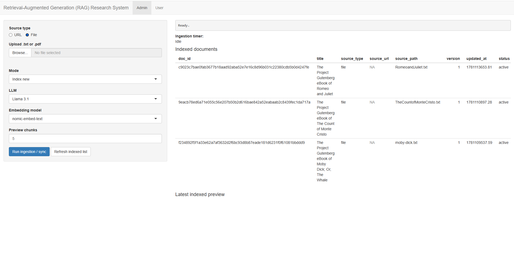
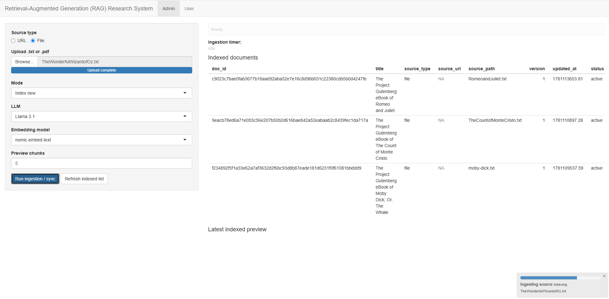
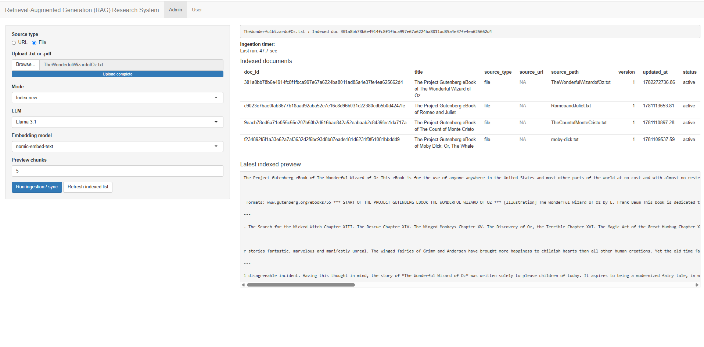
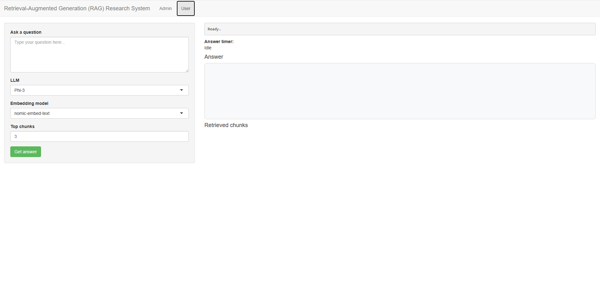
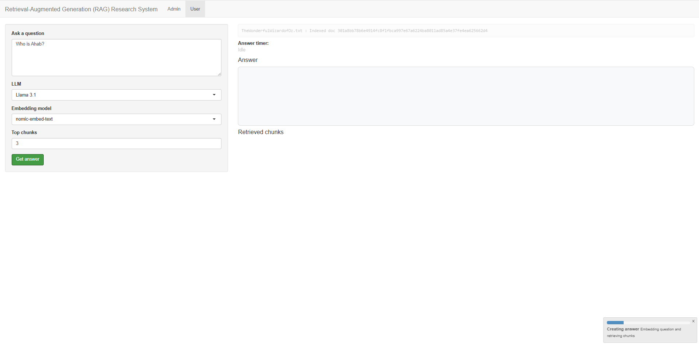
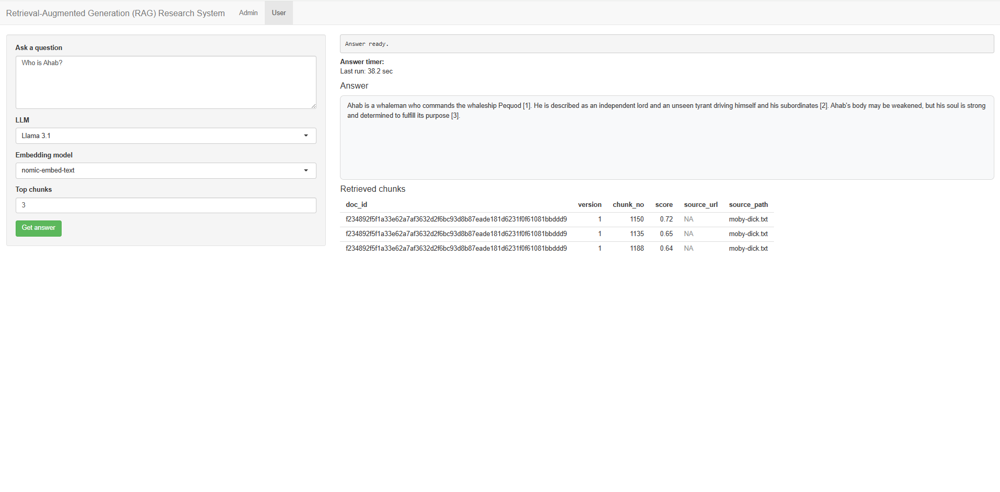
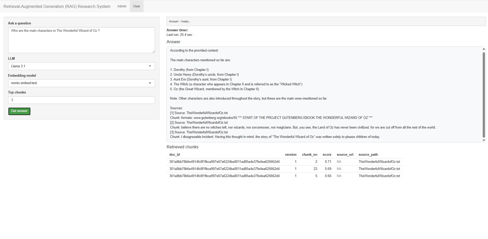
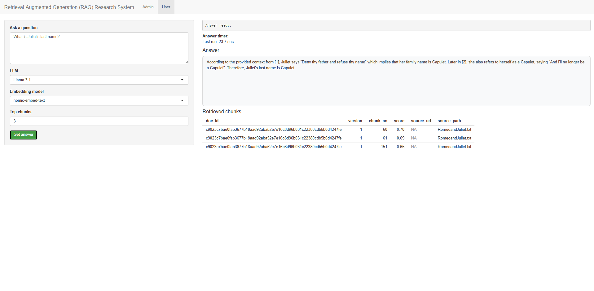

# Retrieval-Augmented Generation (RAG) Research System

R/Shiny application for ingesting web pages and documents, indexing them into DuckDB, retrieving the most relevant text chunks with embeddings, and generating grounded answers using local Ollama models.

## Overview

This project is a privacy-preserving Retrieval-Augmented Generation (RAG) research assistant designed to work entirely on a local machine. It supports two main workflows:

- **Admin workflow** for ingesting and syncing sources
- **User workflow** for asking questions against indexed content

The system extracts text from webpages and uploaded documents, splits the content into chunks, generates embeddings with a local embedding model, stores document metadata and chunk vectors in DuckDB, retrieves top-matching chunks for a question, and sends grounded context to a local language model through Ollama.

## Features

- Ingest content from:
  - Webpage URLs
  - Local `.txt` files
  - Local `.pdf` files
- Local text embedding with Ollama
- Local answer generation with Ollama
- DuckDB-backed document and chunk storage
- Document versioning and snapshot persistence
- Sync mode to avoid re-indexing unchanged content
- Source-grounded answers using retrieved context
- Separate **Admin** and **User** tabs in the Shiny interface
- Progress indicators and runtime timers for ingestion and answering

## Tech Stack

- **R**
- **Shiny**
- **DuckDB**
- **Ollama**
- **httr2**
- **rvest / xml2**
- **jsonlite**
- **digest**
- **pdftools**

## How it works

1. A user provides either a webpage URL or uploads a document.
2. The app extracts text from the source.
3. The text is cleaned and split into overlapping chunks.
4. Each chunk is embedded using a local embedding model.
5. Metadata, snapshots, chunk text, and embeddings are stored in DuckDB.
6. When a question is asked, the app embeds the question and computes similarity against stored chunk embeddings.
7. The top matching chunks are assembled into a grounded prompt.
8. A local LLM generates an answer using only the retrieved context.

## Project structure

Example project layout:

```text
project/
├── app.R
└── output/
    ├── rag_store.duckdb
    └── raw_docs/
```

Generated at runtime:

- `output/rag_store.duckdb` - DuckDB database storing indexed documents and chunks
- `output/raw_docs/` - saved raw text snapshots for indexed sources

## Requirements

Before running the app, make sure you have:

- R installed
- RStudio or another R environment
- Ollama installed and running locally
- The required Ollama models pulled locally

Recommended Ollama models:

```bash
ollama pull llama3.1
ollama pull mistral
ollama pull phi3
ollama pull nomic-embed-text
```

## R package dependencies

Install required packages in R:

```r
install.packages(c(
  "shiny",
  "rvest",
  "xml2",
  "httr2",
  "readtext",
  "DBI",
  "duckdb",
  "digest",
  "jsonlite",
  "stringr",
  "rstudioapi",
  "pdftools"
))
```

## Run the application

Save the script as `app.R`, then run:

```r
shiny::runApp()
```

Or open the project in RStudio and click **Run App**.

## Using the app

### Admin tab

Use the **Admin** tab to ingest and index sources.

Options:
- **Source type**
  - URL
  - File
- **Mode**
  - `Index new`
  - `Sync live source`
- **LLM**
  - Llama 3.1
  - Mistral
  - Phi-3
- **Embedding model**
  - `nomic-embed-text`

Typical ingestion flow:
1. Select URL or File.
2. Enter a webpage URL or upload one or more `.txt` / `.pdf` files.
3. Choose indexing mode.
4. Click **Run ingestion / sync**.
5. Review indexed documents and chunk preview.

### User tab

Use the **User** tab to query indexed content.

Typical question-answering flow:
1. Type a question.
2. Choose LLM and embedding model.
3. Set the number of top chunks to retrieve.
4. Click **Get answer**.
5. Review the generated answer and retrieved source chunks.

## Notes on indexing

- Documents are hashed and versioned.
- In **Sync** mode, unchanged sources are skipped.
- Each indexed source is saved as a text snapshot under `output/raw_docs/`.
- Chunk embeddings are stored as JSON in DuckDB.
- Similarity is computed using cosine similarity between the question embedding and stored chunk embeddings.

## Supported input types

Currently supported:
- Web pages
- `.txt`
- `.pdf`

Unsupported file types will raise an error.

## Database schema

The app creates two DuckDB tables:

### `documents`
Stores:
- document ID
- source type
- source URL or file path
- extracted title
- content hash
- version
- snapshot path
- update timestamp
- status

### `chunks`
Stores:
- chunk ID
- document ID
- version
- chunk number
- chunk text
- serialized embedding
- chunk hash
- source URL or file path
- update timestamp

## Limitations

- The app currently depends on a local Ollama server running at `http://localhost:11434`.
- Only `.txt` and `.pdf` file uploads are supported.
- Large models may fail on systems with limited GPU memory.
- Embeddings are stored in DuckDB as JSON rather than a dedicated vector index.
- Retrieval currently scans all stored chunks in the database.

## Potential improvements

- Add vector indexing for faster retrieval
- Support additional document formats
- Add better chunking strategies
- Add metadata filters
- Add citations formatted directly in the final UI
- Add deployment and packaging support
- Add user authentication and persistent app settings

### Demo


## Screenshots
### Admin tab




### Ingestion




### Ingestion complete



### User tab



### Creating answer



### Answer



### Answer 2



### Answer 3




## Author

**Sergii Iuriev**

Data Scientist | AI/ML Developer | Software Engineer
